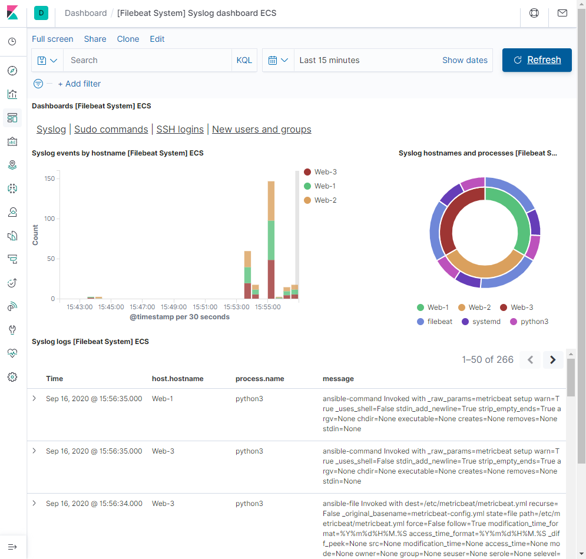

## Automated ELK Stack Deployment

The files in this repository were used to configure the network depicted below.

These files have been tested and used to generate a live ELK deployment on Azure. They can be used to recreate the entire deployment pictured above. Alternatively, the playbook files may be used to install only certain pieces of it, such as Filebeat or Metricbeat.

  - [ELK-playbook](Ansible/elk-playbook.yml)
  - [Filebeat-playbook](Ansible/filebeat-playbook.yml)
  - [Metricbeat-playbook](Anisible/metricbeat-playbook.yml)

This document contains the following details:
- Description of the Topology
- Access Policies
- ELK Configuration
  - Beats in Use
  - Machines Being Monitored
- How to Use the Ansible Build

### Description of the Topology

The main purpose of this network is to expose a load-balanced and monitored instance of DVWA, the D*mn Vulnerable Web Application.

Load balancing ensures that the application will be highly available, in addition to restricting access to the network. The load balancer will efficiently distribute traffic across the DVWA servers.  The Jump Box will restrict remote access to the servers and host Ansible.

Integrating an ELK server allows users to easily monitor the vulnerable VM's for changes to the file system and system metrics.

The configuration details of each machine may be found below.

| Name     | Function | IP Address | Operating System |
|----------|----------|------------|------------------|
| Jump Box | Gateway  | 10.0.1.4   | Ubuntu 18.04     |
| Web-1    |Web Server| 10.0.1.7   | Ubuntu 18.04     |
| Web-2    |Web Server| 10.0.1.6   | Ubuntu 18.04     |
| Web-3    |Web Server| 10.0.1.5   | Ubuntu 18.04     |
| Red-ELK  |ELK Server| 10.1.1.4   | Ubuntu 18.04     |

### Access Policies

The machines on the internal network are not exposed to the public Internet. Rules are added to the Network Security Group (NSG) in Azure to control connections to the virtual machines.

Only the Jump Box machine can accept connections from the Internet. Access to this machine is only allowed from the following IP address: 68.8.1.25.  
*This is the Local Machine IPv4 address and if the Local Machine IP changes the NSG rule will need to be updated with the new IP to allow SSH.

Machines within the network can only be accessed by the Ansible container on the Jumpbox.

A summary of the access policies in place can be found in the table below.

| Name     | Publicly Accessible | Allowed IP Addresses |
|----------|---------------------|----------------------|
| Jump Box | Yes                 | 68.8.1.25            |
| Web-1    | No                  | 10.0.1.4             |
| Web-2    | No                  | 10.0.1.4             |
| Web-3    | No                  | 10.0.1.4             |
| ELK      | No                  | 10.0.1.4             |

### Elk Configuration

Ansible was used to automate the configuration of the ELK machine. No configuration was performed manually, which is advantageous because only a single set of instructions is needed to install and configure any number of virutal machines. Updates to the instruction set will update all virutal machines indentically. 

The playbook implements the following tasks:
- Install Docker
- Install Python Package Installer
- Install Docker Python Package
- Increase Virtual Memory
- Download and Launch Docker ELK Container
- Enable Docker Service

The following screenshot displays the result of running `$ sudo docker ps` after successfully configuring the ELK instance.

### Target Machines & Beats
This ELK server is configured to monitor the following machines:
| Name     | Function | IP Address |
|----------|----------|------------|
| Web-1    |Web Server| 10.0.1.7   |
| Web-2    |Web Server| 10.0.1.6   |
| Web-3    |Web Server| 10.0.1.5   |

We have installed the following Beats on these machines:
- Filebeat
- Metricbeat

These Beats allow us to collect the following information from each machine:
- Filebeat collects log files from the web servers through a harvester and outputs the data to Kibana. In Kibana you can run search queires for specific logs and see visualization of common log formats.
- Metricbeat provides system and service details on the web servers to be viewed on Kibana. Examples of the data from Metricbeat are CPU, memory and file system usage; inbound and outbound traffic stats; and service status.

### Using the Playbook
In order to use the playbook, you will need to have an Ansible control node already configured. Assuming you have such a control node provisioned: 

SSH into the control node and follow the steps below:

- The Ansible host file will need to be udpated to determine which web servers you wish install ELK and beats on. Update the host file with elk and webserver groups and add the private IP's to the respective group. Be sure to include the language interpreter line after each IP. 

- Copy the desired playbook files from this README to `/etc/ansible/roles/`.

> **Setup ELK**
  - From the `/etc/ansible/roles/` directory run the command below to setup the ELK server.
    
    `$ ansible-playbook elk-playbook.yml`

  - Navigate to the Public IP of the ELK server and use port 5601 to load the Kibana site.   
    Example: http://13.77.179.205:5601/
  - Once the site loads click on **Explore on my own** under **Let's get started**.

>**Setup Filebeat and Metricbeat**
  - Download the config files for the beats to `/etc/ansible/files/` using the `curl` commands below.

  **Filebeat** 
  
  `$ curl https://gist.githubusercontent.com/slape/5cc350109583af6cbe577bbcc0710c93/raw/eca603b72586fbe148c11f9c87bf96a63cb25760/Filebeat > /etc/ansible/files/filebeat-config.yml`

  **Metricbeat** 
  
  `$ curl https://gist.githubusercontent.com/slape/58541585cc1886d2e26cd8be557ce04c/raw/0ce2c7e744c54513616966affb5e9d96f5e12f73/metricbeat > /etc/ansible/files/metricbeat-config.yml` 

  - Update the two items below in each beat-config.yml

  - Include the private IP of the ELK server and use the default logon credentials under the Elasticsearch output. 
  
  *Note: Port 9200 may not be needed in the IP address since this is the default port.
  
  - Add the private IP of the ELK server under Kibana. 
  
  *Note: Port 5601 may not be needed in the IP address since this is the default port.
    

  - From the `/etc/ansible/roles/` directory run the commands below to install each beat. 
    
    Filebeat: `$ ansible-playbook filebeat-playbook.yml`
    
    Metricbeat: `$ ansible-playbook metricbeat-playbook.yml`

- Return to the Kibana site for testing to ensure the beats installed correctly.  

**Filebeat Status Check**
  - From the home page click the link **Add log data**.
  - Select **System Logs**.
  - Click on the **DEB** tab under **Getting Started**.
  - Scroll down to **Module Status** and click **Check Data**.
  - You should see the success message below. 
  
  - Click on **System logs dashboard** to see the system log data from the webservers. 

**Metricbeat Status Check**
  - From the home page click the link **Add metric data**.
  - Select **System metrics**.
  - Click on the **DEB** tab under **Getting Started**.
  - Scroll down to **Module Status** and click **Check Data**.
  - You should see the success message below. 

  - Click on **System metrics dashboard** to see the metric data from the webservers.
 

